#TimeToCook
<h1 align="center">TimeToCook</h1>

[View the live project here](https://timetocook-7eed92e3f20e.herokuapp.com/)

TimeToCook is a place where you can find and add recipes. You can also save your favorite ones for easy access. Users can easily browse through list of recipes, each detailed with ingredients, step-by-step cooking instructions, preparation time, and user-submitted ratings to help you choose the best dish for any occasion.


## Index – Table of Contents
- [Index – Table of Contents](#index--table-of-contents)
- [User Experience (UX)](#user-experience-ux)
- [Features](#features)
- [Design](#design)
- [Technologies Used](#technologies-used)
- [Testing](#testing)
- [Deployment](#deployment)
- [Credits](#credits)
- [Bugs](#bugs)
- [Unfixed bugs](#unfixed-bugs)
- [Acknowledgements](#acknowledgements)

## User Experience (UX)

- ### User stories
  - #### A. First Time Visitor
    1. As a first time visitor, I want to see the most rated recipes.
    2. As a first time visitor, I want to be able to register on website.
    3. As a first time visitor, I want to be able to view recipe categories.
    4. As a first time visitor, I want to easily see website's features.
  - #### B. Returning Visitor 
    1. As a returning visitor, I want to be able to log in to the website.
    2. As a returning visitor, I want to be able to add a recipe.
    3. As a returning visitor, I want to be able to edit my recipes.
    4. As a returning visitor, I want to be able to search through all the recipes.
    5. As a returning visitor, I want to be able to change my password.
    6. As a returning visitor, I want to be able to add recipes to favourite.
  - #### C. Administrator
    1. As a administrator, I want to be able to manage categories.
    2. As a administrator, I want to be able to restric access to users.
   
## Features

 - ### NavBar
   - #### 
     The navigation bar allows users to quickly find recipes, save them to favorites, and access login and signup options. The account navigation button features a dropdown menu that displays certain pages only when the user is logged in.
    
   - #### 
     When the user is not logged in
     
   - ####
     Once the user is logged in, their username will be displayed in the dropdown menu. Pages such as ‘Profile’, ‘Add Recipes’, ‘My Recipes’, and ‘Log Out’ will be visible.
     
- ### Index Page
  - #### 
    The index page consists of three card panels, each simply explaining the main features of the website.
    
  - ####
    The index page features the top-rated recipes submitted by users. Only recipes with a rating of 4 or higher are shown, the picture and a short description of the recipe are displayed, including who added the recipe, its rating, difficulty, and category.
    
- ### Footer
  - #### 
    This footer text gives a brief overview of what TimeToCook website offers, links to the social platform and invites users to engage with the content.
    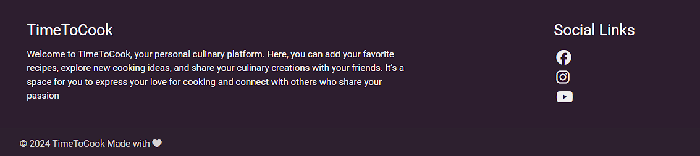
- ### Favourites page
  - #### 
    Users can save recipes by adding them to their favourites. They need to be logged in to be able to add recipes to their favourites.
    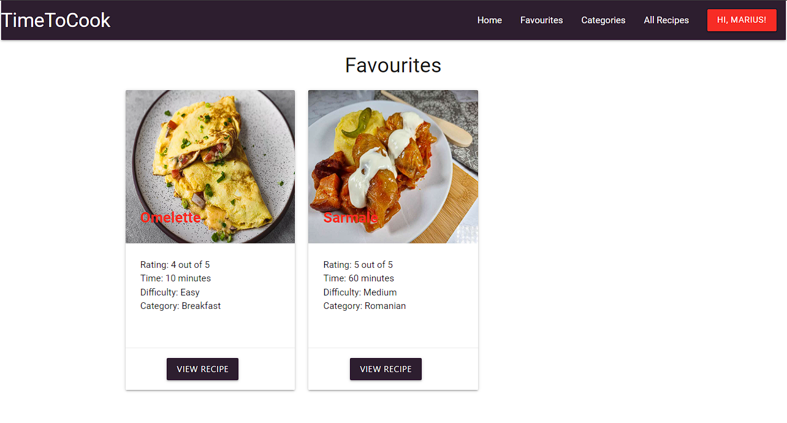
    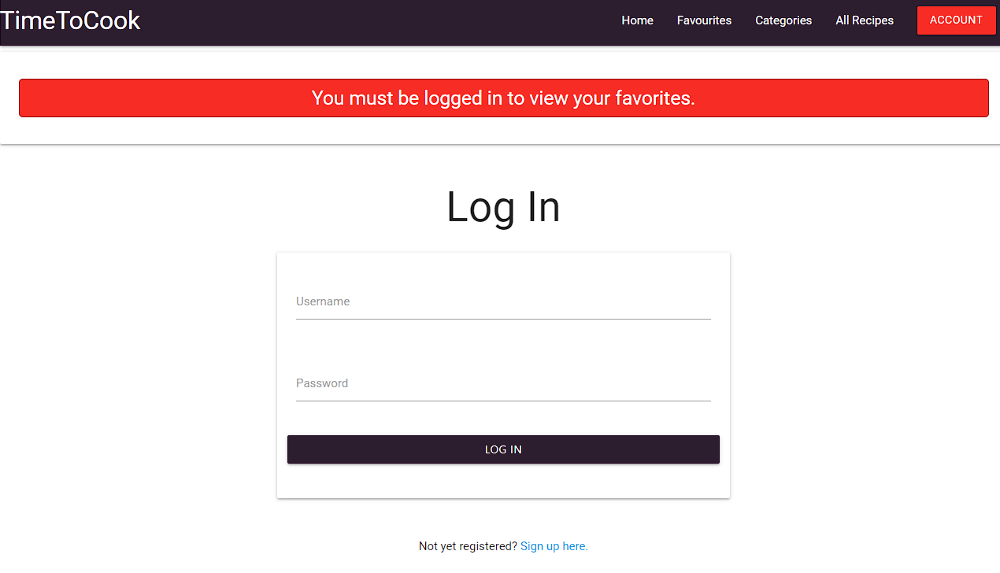
- ### Categories
  - #### 
    The website is intuitively organized into categories to ensure you can find the perfect recipe with ease. The categories can be only added, deleted or edited by admins.
    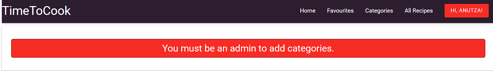
    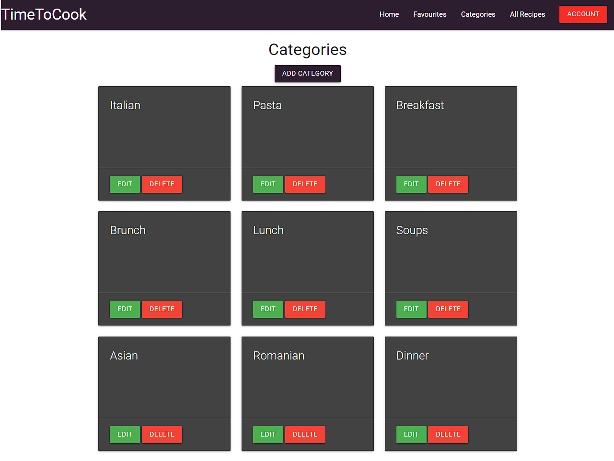
- ### All recipes
  - #### 
    The 'All Recipes' page provides users with a comprehensive view of all the recipes published on the website. The search function is a tool provided to make the recipes on the website easily discoverable.
    
- ### Register
  - ####  
    The registration feature on website is a simple and secure way for new users to create their own accounts, which enables them to add recipes, edit and save to favourite. Users are asked to confirm their password to avoid mistyping it.
    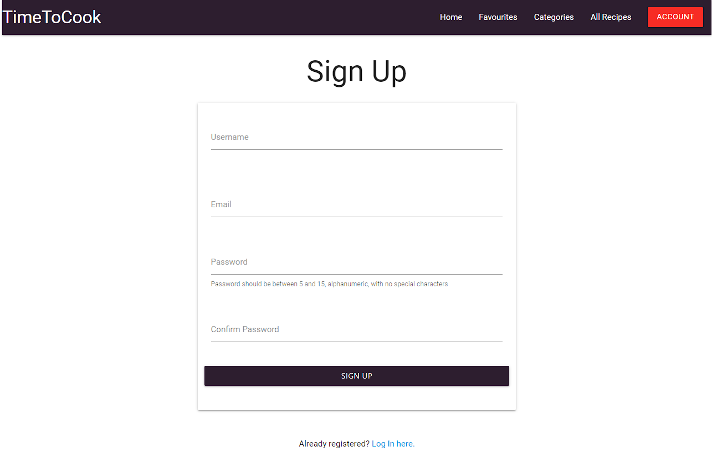
- ### Log In
  - #### 
    When the user is logged in an  message is shown to confirm.
    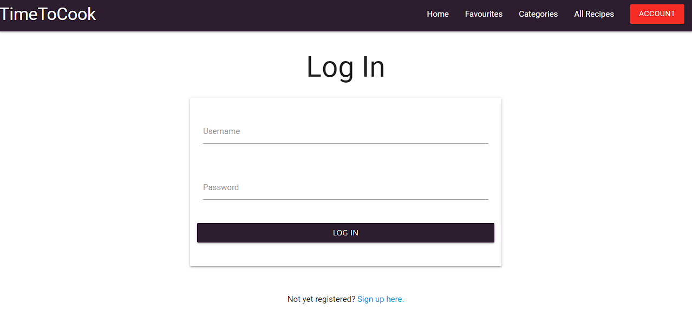
    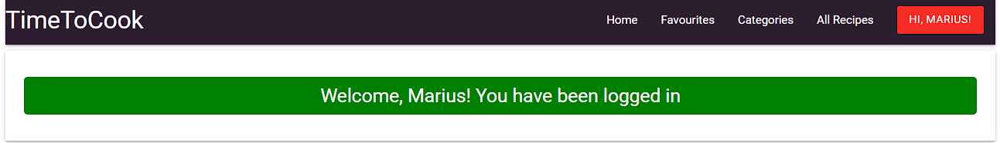
  - ####
    In case the username/password is incorrect or the user has been banned, a message is displayed.
    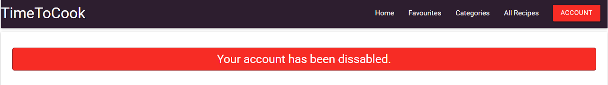
    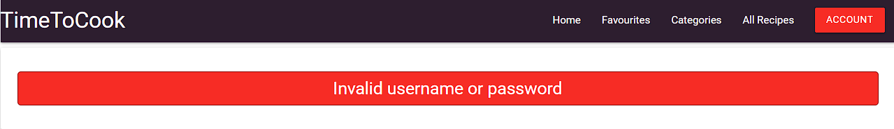
- ### Password Reset
    User can reset his password from profile page.
    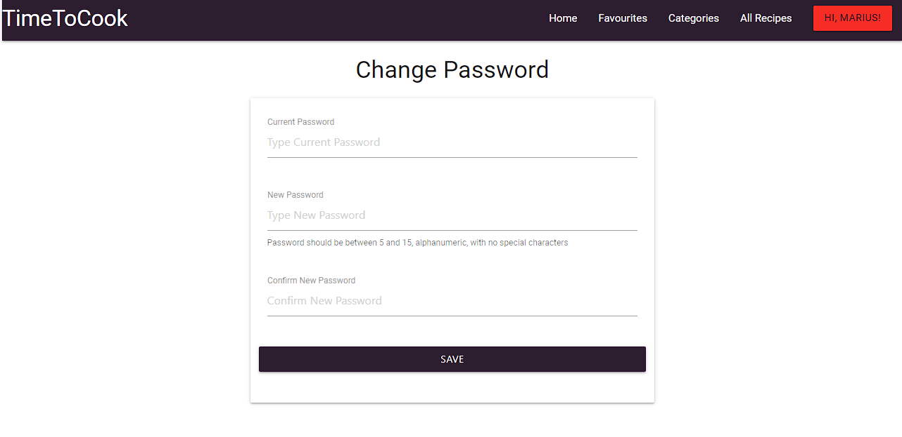


- ### My Recipes
  - #### 
    My recipe page has been designed to help users keep a record of their own recipes that they have added.
    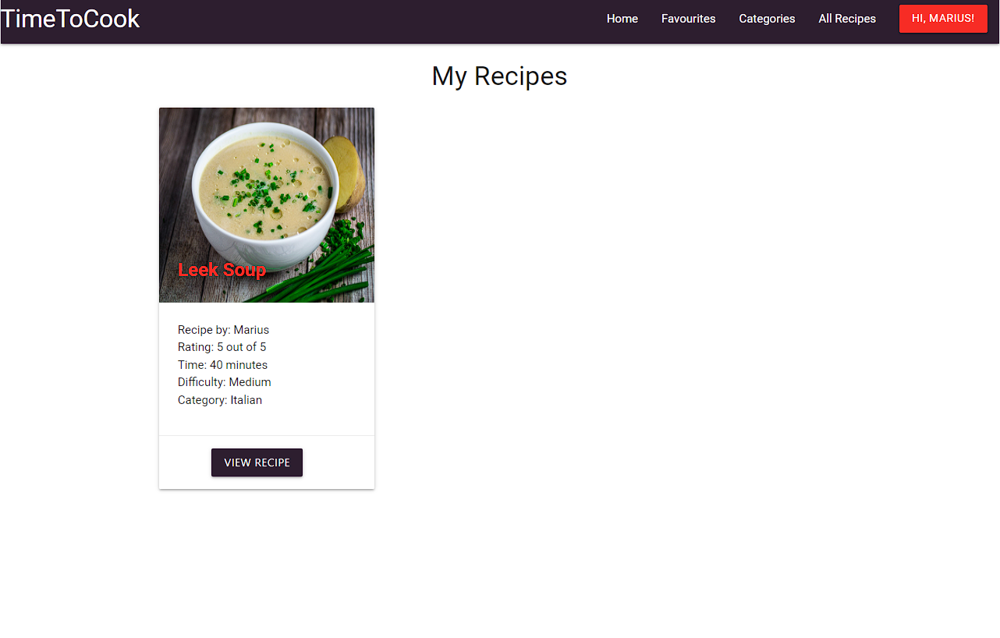
- ### Add Recipes
- ####
  The ‘Add Recipes’ page is accessible after the user has logged in. It features an easy-to-use form that guides you through entering details such as the recipe’s title, ingredients, instructions, rating, and photo link for the recipe
    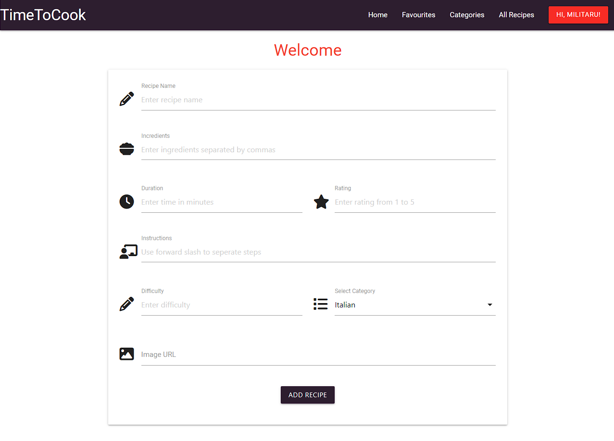
- ### Manage User
  - #### 
    The ‘Manage Users’ page is only accessible to the website administrator. The admin can restrict access for users, and when a user tries to log in, a message is displayed that their account has been disabled. Also admin users can edit any recipe/category.
    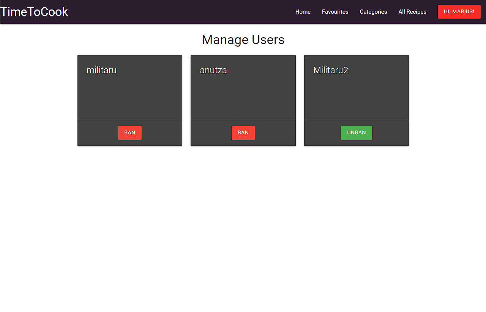
- ### 404 Page
## Design
  - ### Color scheme
    As part of designing the site I decided to use purple, yellow and red as main colours. The pallete has been generated using [coolors.co](https://coolors.co/)
    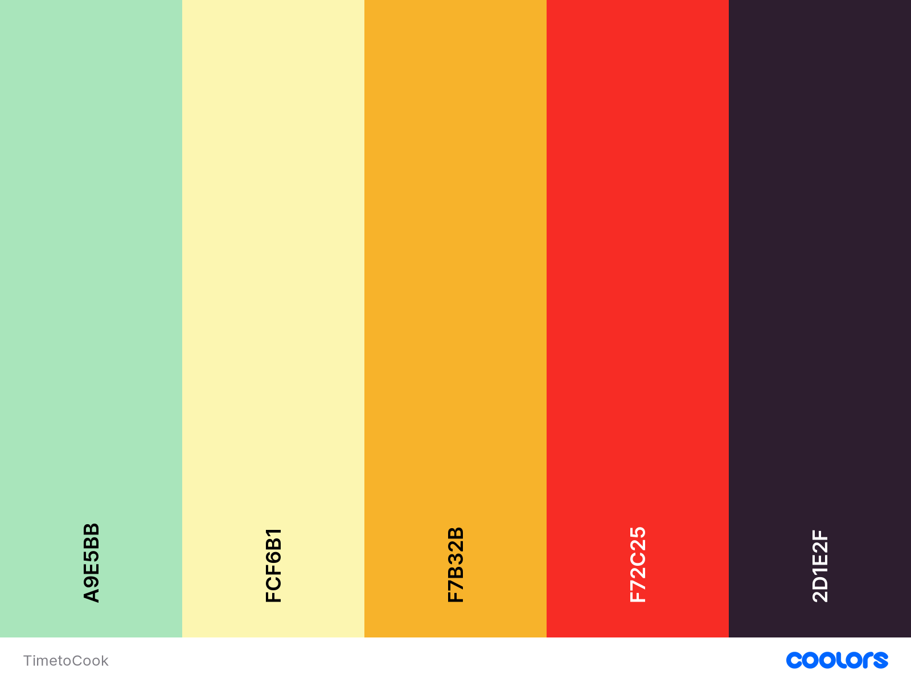
  - ### Typography
    Google Fonts were used to import Roboto into style.css
  - ### Database schema
     PostgreSQL is used as relational database using ElephantSQL as a host service
    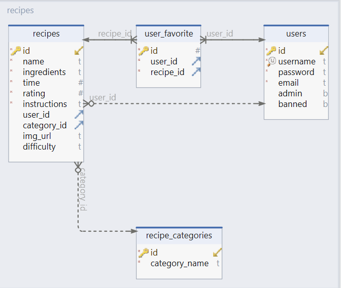
     
- ## Wireframes 
   - ## Home Page <br>
     [Home page desktop](documentation/wireframes/IndexDesktop.png)<br>
     [Home page mobile](documentation//wireframes/IndexMobile.png)
   - ## Favourites
     [Favourite Desktop](documentation/wireframes/FavouritesDekstop.png)<br>
     [Favourite Mobile](documentation/wireframes/FavouritesMobile.png)
   - ## My Recipes
     [My Recipes Dekstop](documentation/wireframes/MyRecipesDekstop.png)<br>
     [My Recipes Mobile](documentation//wireframes/MyRecipesMobile.png)
   - ## Categories
     [Categories Desktop](documentation/wireframes/CategoriesDesktop.png)<br>
     [Categories Mobile](documentation//wireframes/CategoriesMobile.png)
   - ## Edit Categories
     [Edit Categories Desktop](documentation/wireframes/CategoriesDesktop.png)<br>
     [Edit Categories Mobile](documentation//wireframes/CategoriesMobile.png)
   - ## All Recipes
     [All Recipes Desktop](documentation/wireframes/AllrecipesDesktop.png)<br>
     [All Recipes Mobile](documentation//wireframes/AllRecipesMobile.png)
   - ## Add Recipes
     [Add Recipes Desktop](documentation/wireframes/AddRecipeDesktop.png)<br>
     [Add Recipes Mobile](documentation//wireframes/AddRecipeMobile.png)
   - ## Manage Users
     [Manage Users Desktop](documentation/wireframes/ManageUsersDesktop.png)<br>
     [Manage Users Mobile](documentation//wireframes/ManageUsersMobile.png)
   - ## Register
     [Register Desktop](documentation/wireframes/RegisterDekstop.png)<br>
     [Register Mobile](documentation//wireframes/RegisterMobile.png)
   - ## Log In
     [Log In Desktop](documentation/wireframes/LogInDesktop.png)<br>
     [Log In Mobile](documentation//wireframes/LogInMobile.png)
   - ## View Recipe
     [View Recipe Desktop](documentation/wireframes/ViewRecipeDekstop.png)<br>
     [View Recipe Mobile](documentation//wireframes/ViewRecipeMobile.png)
## Technologies Used
  - ### Languages Used
    -   [HTML5](https://en.wikipedia.org/wiki/HTML5)
    -   [CSS3](https://en.wikipedia.org/wiki/Cascading_Style_Sheets)
    -   [JavaScript](https://en.wikipedia.org/wiki/JavaScript)
    -   [Python](https://www.python.org/)
   
  - ### Frameworks, Libraries and Programs Used
    -   [Google Fonts:](https://fonts.google.com/) was used to import the 'Roboto' font into the style.css file 
    -   [Git:](https://git-scm.com/) was used for version control by utilising VSCode terminal to commit to Git and Push to GitHub.
    -   [GitHub:](https://github.com/) was used as the repository for the projects code after being pushed from Git.
    -   [Visual Studio Code](https://code.visualstudio.com/) was used as IDE editor.
    -   [Balsamiq:](https://balsamiq.com/) was used to create the wireframes.
    -   [Flask:](https://flask.palletsprojects.com/en/3.0.x/) Micro web framework written in Python.
    -   [ElephantSQL:](https://www.elephantsql.com/) PostgreSQL database hosting service for hosting website database.
    -   [Materializecss:](https://materializecss.com/) For making the website responsive.
    -   [DbSchema:](https://dbschema.com/) For creating the database schema logic and     diagram.
## Testing
  - ### For testing please refer to the [TESTING.md](/TESTING.md)

## Deployment
- ## GitHub
  
  - ### Cloning
    - Go to the [GitHub repository](https://github.com/mariusmilitaru32/TimeToCook.git) 
    - Locate the Code button above the list of files and click it
    - Select if you prefer to clone using HTTPS, SSH, or GitHub CLI and click the copy button to copy the URL to your clipboard
    - Open Git Bash or Terminal
    - Change the current working directory to the one where you want the cloned directory
    - In your IDE Terminal, type the following command to clone my repository: "git clone https://github.com/mariusmilitaru32/TimeToCook.git".
  - ### Forking
    By forking the GitHub Repository, we make a copy of the original repository on our GitHub account to view and/or make changes without affecting the original owner's repository.
    You can fork this repository by using the following steps:
    
      - Log in to GitHub and locate the [GitHub Repository](https://github.com/mariusmilitaru32/TimeToCook.git)
      - At the top of the Repository (not top of page) just above the "Settings" Button on the menu, locate the "Fork" Button.
      - Once clicked, you should now have a copy of the original repository in your own GitHub account!
  - ## ElephantSQL
    1. Go to ElephantSQL.com and select “Get a managed database today”.
    2. Choose the “TINY TURTLE” plan and click “Try now for FREE”.
    3. Log in with your GitHub account.
    4. Create a team with your name, agree to the Terms of Service, select Yes for GDPR, and provide your email.
    5. With your account set up, click on “Create New Instance” to start configuring your database.
    6. For the new database plan:
        - Assign a Name to your plan, usually related to your project.
        - Choose the Tiny Turtle (Free) plan.
        - Leave the Tags section empty unless you have tags to add.
        - Pick a data center location near you. For example, EU-West-1 (Ireland) might be a     suitable choice.
        - Click on "Review" to verify your selections.
    7. Confirm that the details are correct and then click “Create instance” to finalize the creation of your database.
    8. Go back to your ElephantSQL dashboard and select the instance name relevant to your project.
    9. In the URL section, use the copy icon to copy your database URL. Keep this URL handy as you'll need it shortly.
  - ## Heroku
    1. Create requirements.txt and Procfile for Heroku deployment. 
         - Use "pip3 freeze --local > requirements.txt" to generate requirements
         - Use "echo web: python run.py > Procfile" (replace run.py with your app’s main file). Ensure the Procfile has no trailing blank lines. Save, commit, and push these files to GitHub.
    2. Log in to Heroku.com, create a new app, and give it a unique name.
    3. Connect the app to your GitHub repository under the deployment section.
    4. In the settings tab, reveal config vars and add the environment variables used in env.py (IP, PORT, SECRET_KEY, DATABASE_URL, DEBUG). Make sure that DEBUG is removed in production enviroment.
    5. Enable automatic deploys and Heroku will start building the app.
    6. In the dashboard, select run console to set up the database tables on ElephantSQL by running 
          ```bash
          from timetocook import db
          db.create_all()
          exit()
          ```
## Credits
 - [Stackoverflow](https://stackoverflow.com/) for the confirming the password and img url replace if invalid link is provided.
## Bugs
  1. The first bug I encountered was within the 'delete category' function; it caused a random category to be deleted instead of the selected one, which was due to an issue with the MaterializeCSS modal. To fix this bug I had to specify in the modal trigger href what category id should be deleted. 
      ``` 
        href="#modal{{category.id}}" 

      ```
  2. The second bug I encountered was within the UserFavorite database model. When a recipe was deleted, it was not removed from the UserFavorite database. As a result, the app was crashing. To solve this bug, I had to create a relationship between the UserFavorite and Recipe database models. 
      ```ruby
        recipe = db.relationship(
              "Recipe",
              backref=db.backref(
                  "favorited_by", lazy="dynamic", cascade="all, delete-orphan"
              ),
          ) 
      ```
   3. The third bug I encountered was related to the recipe image. The issue lies in how the image is rendered, which is based on a user-supplied link, using the following img source attribute in Flask: 
      ```ruby
      
      ``` 
      In cases where the link is not provided, or if the link is invalid and an image cannot be rendered, I have created a JavaScript script to replace with a website logo image.
## Unfixed bugs
  - The unresolved bug is related to the image provided by the user. For example, if the user is simply typing text into the image URL field, the JavaScript replaces the missing image with a logo. However, I still receive a request in the Flask app, and the browser reports this as an error. I could't find a way to solve this request.
  - Flask request <br>
    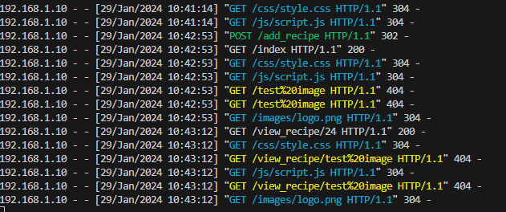
  - Browser console <br>
    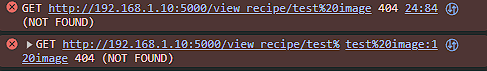
  - The website logo is rendered fine <br>
    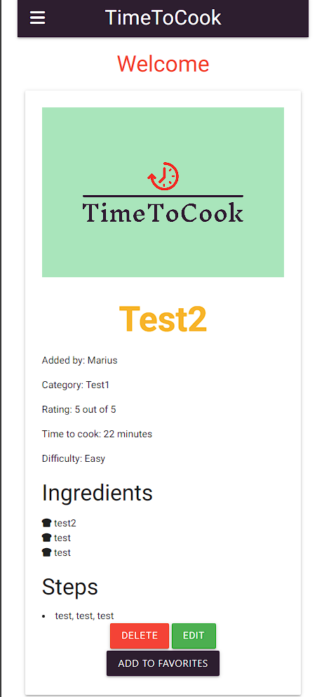
  - Recipe URL <br>
    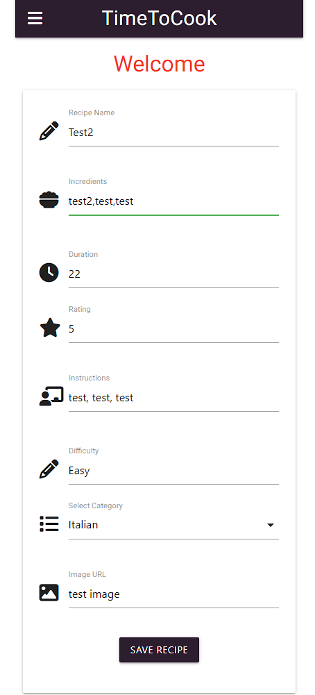
## Acknowledgements
  - I would like to thank [Codeinstitute](https://codeinstitute.net/) slack community for helping me during my studies and project creation.
  