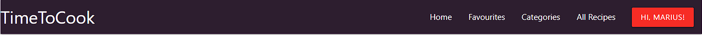
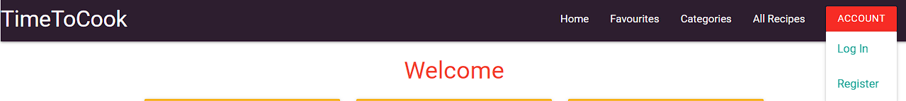
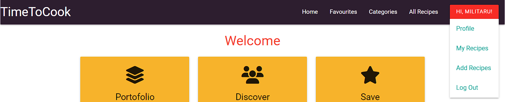
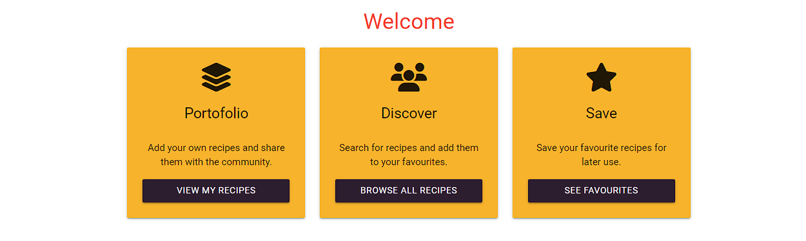
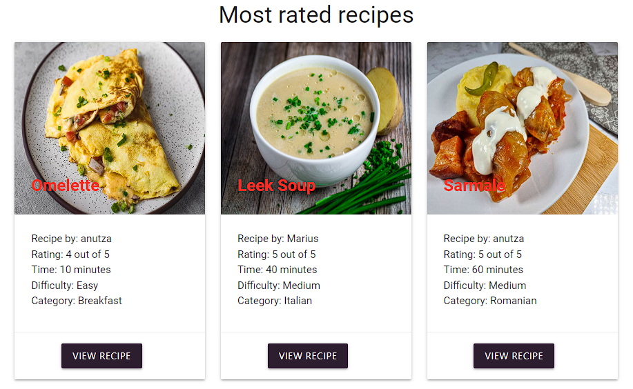

#TimeToCook
<h1 align="center">TimeToCook</h1>

[View the live project here](https://timetocook-7eed92e3f20e.herokuapp.com/)

TimeToCook is a place where you can find and add recipes. You can also save your favorite ones for easy access. Users can easily browse through list of recipes, each detailed with ingredients, step-by-step cooking instructions, preparation time, and user-submitted ratings to help you choose the best dish for any occasion.

## Index – Table of Contents
- [Index – Table of Contents](#index--table-of-contents)
- [User Experience (UX)](#user-experience-ux)
- [Features](#features)

## User Experience (UX)

- ### User stories
  - #### A. First Time Visitor
    1. As a first time visitor, I want to see the most rated recipes.
    2. As a first time visitor, I want to be able to register on website.
    3. As a first time visitor, I want to be able to view recipe categories.
    4. As a first time visitor, I want to easily see website's features.
  - #### B. Returning Visitor 
    1. As a returning visitor, I want to be able to log in to the website.
    2. As a returning visitor, I want to be able to add a recipe.
    3. As a returning visitor, I want to be able to edit my recipes.
    4. As a returning visitor, I want to be able to search through all the recipes.
    5. As a returning visitor, I want to be able to change my password.
    6. As a returning visitor, I want to be able to add recipes to favourite.
  - #### C. Administrator
    1. As a administrator, I want to be able to manage categories.
    2. As a administrator, I want to be able to restric access to users.
   
## Features

 - ### NavBar
   - #### 
     The navigation bar allows users to quickly find recipes, save them to favorites, and access login and signup options. The account navigation button features a dropdown menu that displays certain pages only when the user is logged in.
    
   - #### 
     When the user is not logged in
     
   - ####
     Once the user is logged in, their username will be displayed in the dropdown menu. Pages such as ‘Profile’, ‘Add Recipes’, ‘My Recipes’, and ‘Log Out’ will be visible.
     
- ### Index Page
  - #### 
    The index page consists of three card panels, each simply explaining the main features of the website.
    
  - ####
    The index page features the top-rated recipes submitted by users. Only recipes with a rating of 4 or higher are shown, the picture and a short description of the recipe are displayed, including who added the recipe, its rating, difficulty, and category.
    
- ### Footer
  - #### 
    This footer text gives a brief overview of what TimeToCook website offers, links to the social platform and invites users to engage with the content