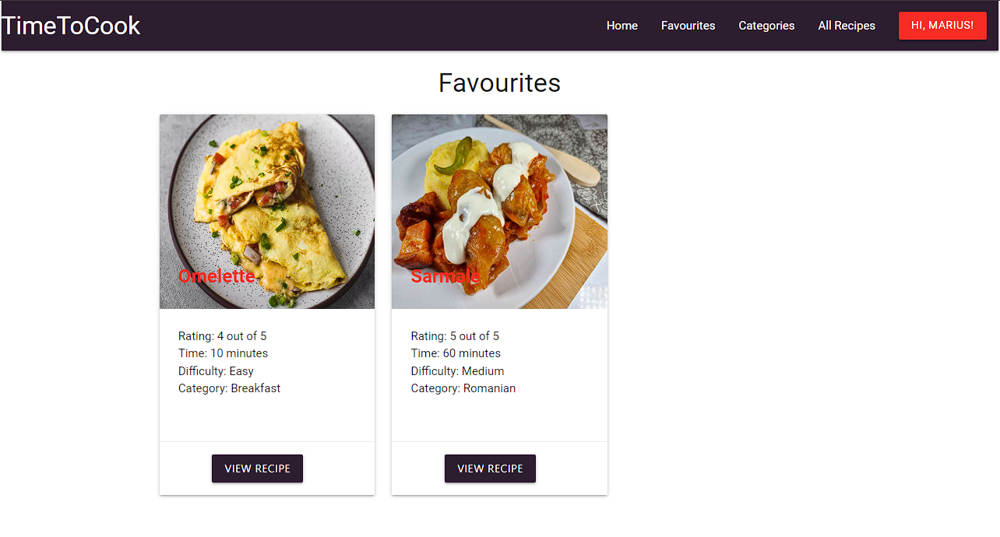
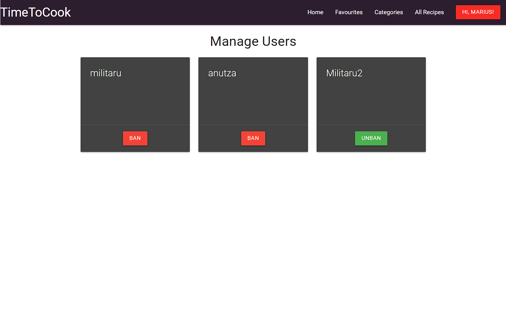

Back to [README.md](/README.md)

- ## Validator Testing
  - ### HTML Validator
    - [HTML results Index page](https://validator.w3.org/nu/?doc=https%3A%2F%2Ftimetocook-7eed92e3f20e.herokuapp.com%2Findex): no errors/warnings
    - [HTML results Favourite page](https://validator.w3.org/nu/?doc=https%3A%2F%2Ftimetocook-7eed92e3f20e.herokuapp.com%2Ffavourites): no errors/warnings
    - [HTML results Categories page](https://validator.w3.org/nu/?doc=https%3A%2F%2Ftimetocook-7eed92e3f20e.herokuapp.com%2Fcategories): no errors/warnings
    - [HTML results All Recipes page](https://validator.w3.org/nu/?doc=https%3A%2F%2Ftimetocook-7eed92e3f20e.herokuapp.com%2Fallrecipes): no errors/warnings
    - [HTML results Log In page](https://validator.w3.org/nu/?doc=https%3A%2F%2Ftimetocook-7eed92e3f20e.herokuapp.com%2Flogin): no errors/warnings
    - [HTML results Register page](https://validator.w3.org/nu/?doc=https%3A%2F%2Ftimetocook-7eed92e3f20e.herokuapp.com%2Fregister): no errors/warnings
    - [HTML results My Recipe page](https://validator.w3.org/nu/?doc=https%3A%2F%2Ftimetocook-7eed92e3f20e.herokuapp.com%2Fmyrecipes): no errors/warnings
    - [HTML results Add Recipe page](https://validator.w3.org/nu/?doc=https%3A%2F%2Ftimetocook-7eed92e3f20e.herokuapp.com%2Fadd_recipe): no errors/warnings
    - [HTML results Users page](https://validator.w3.org/nu/?doc=https%3A%2F%2Ftimetocook-7eed92e3f20e.herokuapp.com%2Fusers): no errors/warnings
    - [HTML results View Recipe page](https://validator.w3.org/nu/?doc=https%3A%2F%2Ftimetocook-7eed92e3f20e.herokuapp.com%2Fview_recipe%2F18): no errors/warnings
    - [HTML results Add Category page](https://validator.w3.org/nu/?doc=https%3A%2F%2Ftimetocook-7eed92e3f20e.herokuapp.com%2Fadd_categories): no errors/warnings
    - [HTML results Edit Category page](https://validator.w3.org/nu/?doc=https%3A%2F%2Ftimetocook-7eed92e3f20e.herokuapp.com%2Fedit_category%2F11): no errors/warnings
    - [HTML results Edit Recipe page](https://validator.w3.org/nu/?doc=https%3A%2F%2Ftimetocook-7eed92e3f20e.herokuapp.com%2Fedit_recipe%2F11): no errors/warnings
  - ### CSS Validator
    -One Error due to materializecss library.   
    
  - ### JsLint Validator
    - ### confirmpas.js 
       One warning due to using arrow function
      
    -  ### script.js
       Few warnings due to  materializecss initialization
       
  - ### Python Linter by CodeInstitute
    - ### routes.py 
       
    - ### models.py 
       
    - ### __init__.py 
       
    - ### run.py 
       

- ## Browser Compatibility
  - Testing has been carried out on the following browsers with no issues:
    - Chrome Version 119.0.6045.124 (Official Build) (64-bit)
    - Firefox Version 119.0.1 (64-bit)
    - Edge Version 119.0.2151.58 (Official build) (64-bit)
   - No issues/warnings are being reported in the browser console.Apart from the bug reported in Bugs sesction
   - 
   - 
   - 
- ## User Story Testing
 | User Story                                                                   | Screenshot                                                |
 | ---------------------------------------------------------------------------- | --------------------------------------------------------- |
 | As a first time visitor, I want to see the most rated recipes.               |     |
 | As a first time visitor, I want to be able to register on website            |     |
 | As a first time visitor, I want to be able to view recipe categories.        |       |
 | As a returning visitor, I want to be able to log in to the website           |            |
 | As a returning visitor, I want to be able to add a recipe.                   |       |
 | As a returning visitor, I want to be able to edit my recipes.                |       |
 | As a returning visitor, I want to be able to search through all the recipes. |       |
 | As a returning visitor, I want to be able to change my password.             |    |
 | As a returning visitor, I want to be able to add recipes to favourite.       |       |
 | As a administrator, I want to be able to manage categories.                  |  |
 | As a administrator, I want to be able to restric access to users.            |        |

