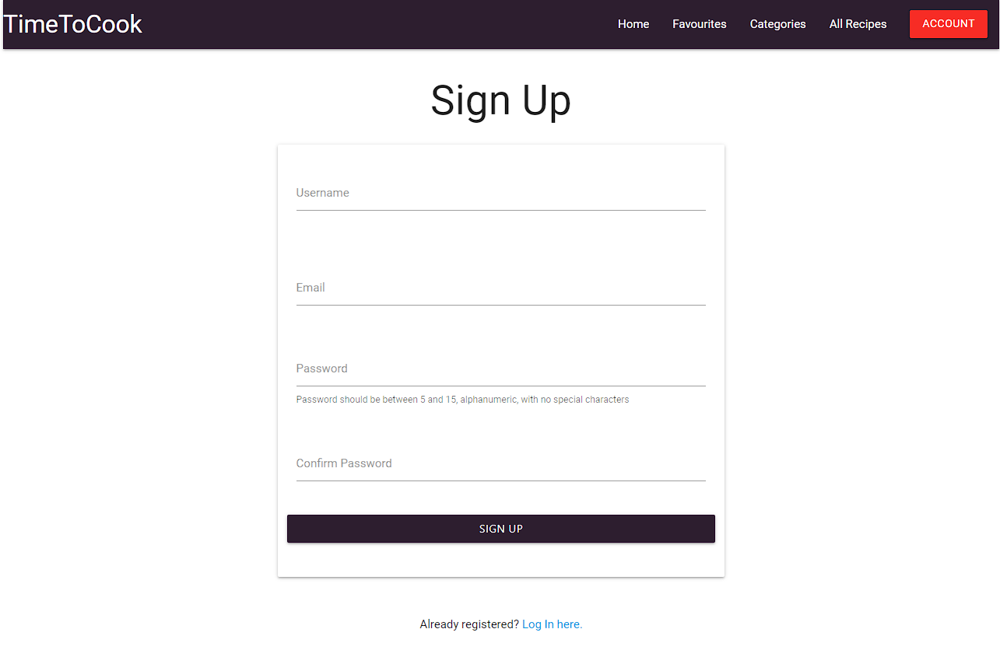
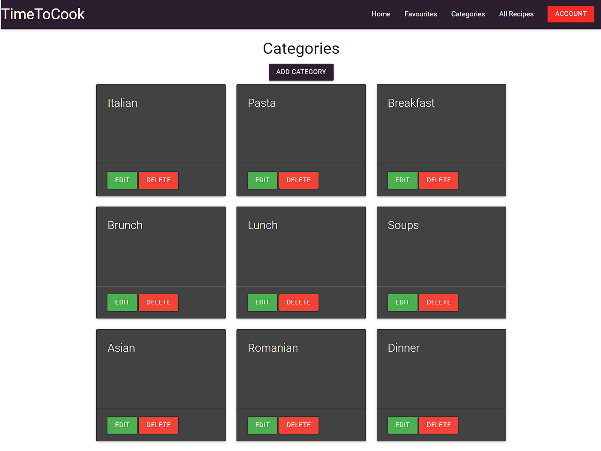
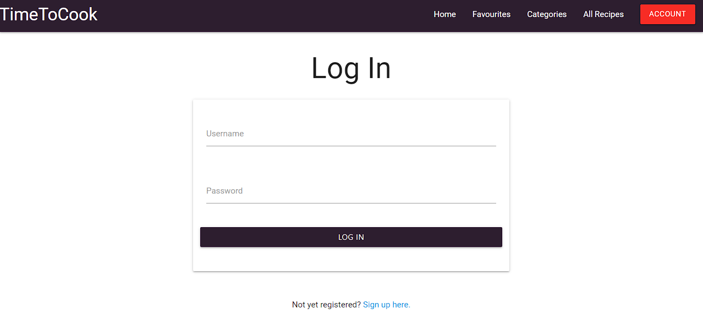
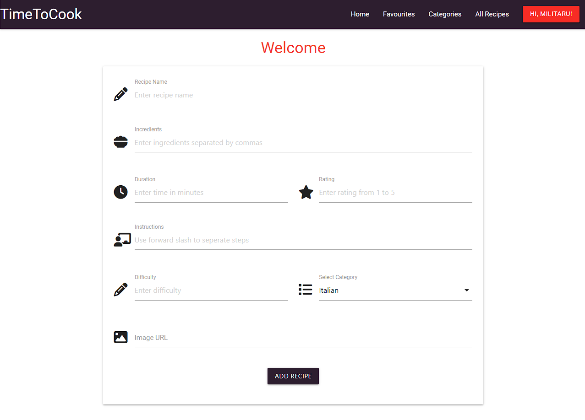
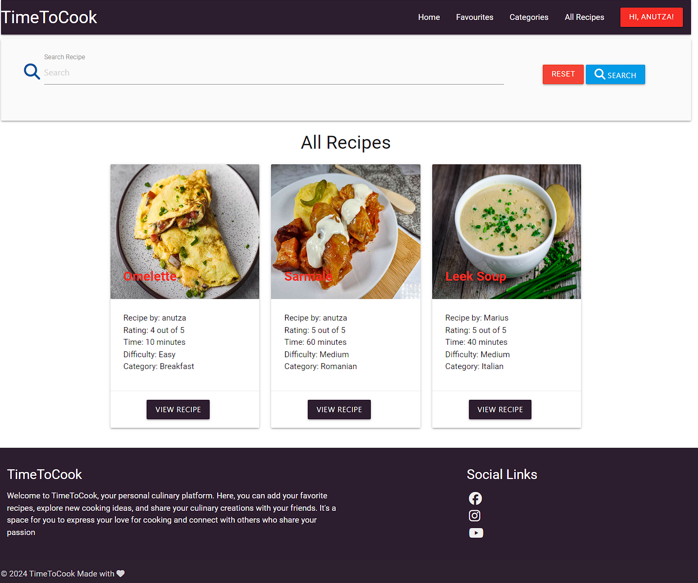
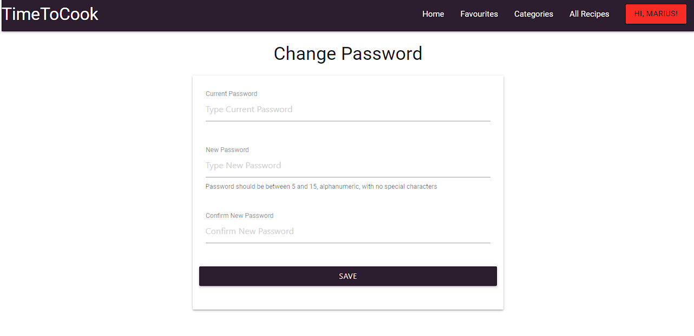
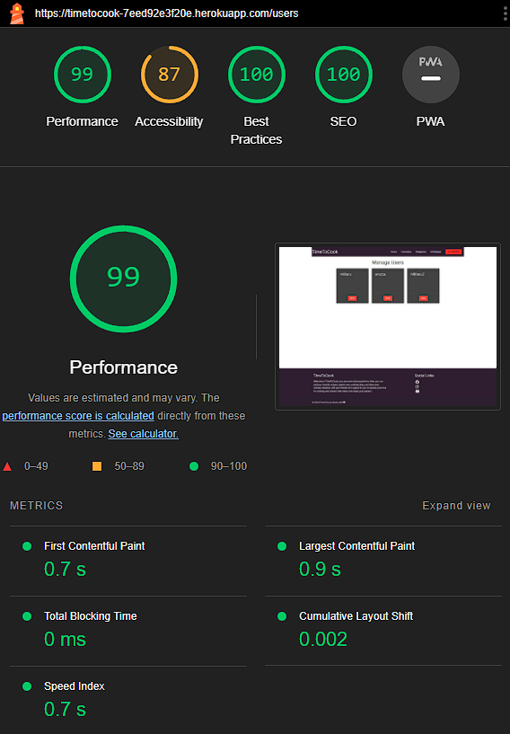

Back to [README.md](/README.md)

- ## Validator Testing
  - ### HTML Validator
    - [HTML results Index page](https://validator.w3.org/nu/?doc=https%3A%2F%2Ftimetocook-7eed92e3f20e.herokuapp.com%2Findex): no errors/warnings
    - [HTML results Favourite page](https://validator.w3.org/nu/?doc=https%3A%2F%2Ftimetocook-7eed92e3f20e.herokuapp.com%2Ffavourites): no errors/warnings
    - [HTML results Categories page](https://validator.w3.org/nu/?doc=https%3A%2F%2Ftimetocook-7eed92e3f20e.herokuapp.com%2Fcategories): no errors/warnings
    - [HTML results All Recipes page](https://validator.w3.org/nu/?doc=https%3A%2F%2Ftimetocook-7eed92e3f20e.herokuapp.com%2Fallrecipes): no errors/warnings
    - [HTML results Log In page](https://validator.w3.org/nu/?doc=https%3A%2F%2Ftimetocook-7eed92e3f20e.herokuapp.com%2Flogin): no errors/warnings
    - [HTML results Register page](https://validator.w3.org/nu/?doc=https%3A%2F%2Ftimetocook-7eed92e3f20e.herokuapp.com%2Fregister): no errors/warnings
    - [HTML results My Recipe page](https://validator.w3.org/nu/?doc=https%3A%2F%2Ftimetocook-7eed92e3f20e.herokuapp.com%2Fmyrecipes): no errors/warnings
    - [HTML results Add Recipe page](https://validator.w3.org/nu/?doc=https%3A%2F%2Ftimetocook-7eed92e3f20e.herokuapp.com%2Fadd_recipe): no errors/warnings
    - [HTML results Users page](https://validator.w3.org/nu/?doc=https%3A%2F%2Ftimetocook-7eed92e3f20e.herokuapp.com%2Fusers): no errors/warnings
    - [HTML results View Recipe page](https://validator.w3.org/nu/?doc=https%3A%2F%2Ftimetocook-7eed92e3f20e.herokuapp.com%2Fview_recipe%2F18): no errors/warnings
    - [HTML results Add Category page](https://validator.w3.org/nu/?doc=https%3A%2F%2Ftimetocook-7eed92e3f20e.herokuapp.com%2Fadd_categories): no errors/warnings
    - [HTML results Edit Category page](https://validator.w3.org/nu/?doc=https%3A%2F%2Ftimetocook-7eed92e3f20e.herokuapp.com%2Fedit_category%2F11): no errors/warnings
    - [HTML results Edit Recipe page](https://validator.w3.org/nu/?doc=https%3A%2F%2Ftimetocook-7eed92e3f20e.herokuapp.com%2Fedit_recipe%2F11): no errors/warnings
  - ### CSS Validator
    -One Error due to materializecss library.   
    
  - ### JsLint Validator
    - ### confirmpas.js 
       One warning due to using arrow function
      
    -  ### script.js
       Few warnings due to  materializecss initialization
       
  - ### Python Linter by CodeInstitute
    - ### routes.py 
       
    - ### models.py 
       
    - ### __init__.py 
       
    - ### run.py 
       

- ## Browser Compatibility
  - Testing has been carried out on the following browsers with no issues:
    - Chrome Version 119.0.6045.124 (Official Build) (64-bit)
    - Firefox Version 119.0.1 (64-bit)
    - Edge Version 119.0.2151.58 (Official build) (64-bit)
   - No issues/warnings are being reported in the browser console.Apart from the bug reported in Bugs sesction
   - 
   - 
   - 
- ## User Story Testing
 | User Story                                                                   | Screenshot                                                |
 | ---------------------------------------------------------------------------- | --------------------------------------------------------- |
 | As a first time visitor, I want to see the most rated recipes.               |     |
 | As a first time visitor, I want to be able to register on website            |     |
 | As a first time visitor, I want to be able to view recipe categories.        |       |
 | As a returning visitor, I want to be able to log in to the website           |            |
 | As a returning visitor, I want to be able to add a recipe.                   |       |
 | As a returning visitor, I want to be able to edit my recipes.                |       |
 | As a returning visitor, I want to be able to search through all the recipes. |       |
 | As a returning visitor, I want to be able to change my password.             |    |
 | As a returning visitor, I want to be able to add recipes to favourite.       |       |
 | As a administrator, I want to be able to manage categories.                  |  |
 | As a administrator, I want to be able to restric access to users.            |        |

 - ## Lighthouse test
| Page         | Device  | Screenshot                                                             | Notes                                          |
| ------------ | ------- | ---------------------------------------------------------------------- | ---------------------------------------------- |
| Home         | Mobile  |         | 78 performance due to info cards on index page |
| Home         | Desktop |        |                                                |
| Favourites   | Mobile  |    |                                                |
| Favourites   | Desktop |   |                                                |
| Categories   | Mobile  |    |                                                |
| Categories   | Desktop |   |                                                |
| All Recipes  | Mobile  |    |                                                |
| All Recipes  | Desktop |   |                                                |
| Log In       | Mobile  |         |                                                |
| Log In       | Desktop |        |                                                |
| Register     | Mobile  |      |                                                |
| Register     | Desktop |     |                                                |
| My Recipes   | Mobile  |     |                                                |
| My Recipes   | Desktop |     |                                                |
| Add Recipe   | Mobile  |     |                                                |
| Add Recipe   | Desktop |    |                                                |
| Manage Users | Mobile  |   |                                                |
| Manage Users | Desktop |  |                                                |
| Profile      | Mobile  |       |                                                |
| Profile      | Desktop |      |                                                |

- ## Manual Testing
|       Page        |                        User Action                        |                                                     Expected Results                                                      | Pass/Fail | Comments |
| :---------------: | :-------------------------------------------------------: | :-----------------------------------------------------------------------------------------------------------------------: | :-------: | :------: |
|     Home Page     |                    Click on logo name                     |                                                   Redirect to home page                                                   |   Pass    |
|                   |                 Click on home button menu                 |                                                   Redirect to home page                                                   |   Pass    |
|                   |                Click on favourites butoon                 |                              Redirect to favourite page and message for log in is displayed                               |   Pass    |
|                   |                Click on All recipe button                 |                                               Redirect to All recipes page                                                |   Pass    |
|                   |              Click on dropdown account menu               |                                                    Dropdown menu open                                                     |   Pass    |
|                   |                    User not logged in                     |                                        Only login and register pages are available                                        |   Pass    |
|                   |                Click on login menu button                 |                                                  Redirect to login page                                                   |   Pass    |
|                   |               Click on register menu button               |                                                 Redirect to register page                                                 |   Pass    |
|                   |                 User logged in(non admin)                 |                  The rest of pages are displayed(Add recipes,Profile,My Recipes)and access to favourites                  |   Pass    |
|     Register      | User enter username, email, password and confirm password |                         Validation rule for the username and password and confirm password error                          |   Pass    |
|     Register      |                   Press sign up button                    |                                    Confirmation message displayed and account created                                     |   Pass    |
|      Log in       |                 Enter log in credentials                  |                             Log in confirmation message displayed and log in pages available                              |   Pass    |
|      Log in       |              Enter wrong log in credentials               |                                      Message with wrong username/password displayed                                       |   Pass    |
|    Favourites     |     Open Favourites page(no favourites and logged in)     |                              If the user has no favourite no favourite message is displayed                               |   Pass    |
|    Favourites     |    Open Favourites page(favourite added and logged in)    |                             All the recipes that have been added to favourites are displayed                              |   Pass    |
|    Categories     |               click on the categories page                |                           All the categories are being displayed with no access to edit/remove                            |   Pass    |
|  Edit Categories  |                     Edit one category                     |            The category name changed for all the recipes within that category. confirmation message displayed             |   Pass    |
| Delete Categories |                    Delete one category                    |                The category has been removed with all the related recipes, confirmation message displayed                 |   Pass    |
|    All Recipes    |               click on the all recipes page               | All recipes are being displayed with the option to view and favourite them(edit or remove only for recipe owner or admin) |   Pass    |
|      Profile      |       click on the profile page and reset password        |                             Password has been reset and a confirmation message is displayed.                              |   Pass    |
|    My Recipes     |                 click on My Recipes page                  |                                         All the user recipes are being displayed                                          |   Pass    |
|    Add recipe     |       click on the add recipe page and fill up form       |                      The recipe has been added successfully and a confirmation message is displayed.                      |   Pass    |
|    Edit Recipe    |             click on the recipe edit and save             |                     The recipe has been edited successfully and a confirmation message is displayed.                      |   Pass    |
|   Delete Recipe   |                     Delete the recipe                     |         The recipe has been deleted successfully, removed from favourite and a confirmation message is displayed.         |   Pass    |
|      Log out      |                 click on the log out page                 |                User is logged out and the user pages are hidden. Log out comfirmation message is displayed                |   Pass    |
|   Manage Users    |    click on the manage users page and ban/unban users     |                           The user is banned/unbanned and access is either removed or granted.                            |   Pass    |
|        404        |                   Enter an invalid url                    |                                   The 404 page is being displayed with the 404 message                                    |   Pass    |
